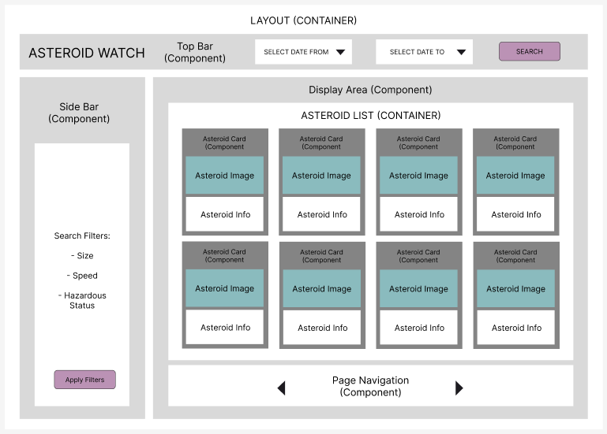

# Asteroid Watch

<br>

## App Overview

Asteroid Watch: A React TypeScript application that allows users to track and filter near-Earth asteroids. The app uses the <strong>NASA NeoWs API</strong> to fetch asteroid data and provides a user-friendly interface to display and filter this information.

-   **Date Range Selection:** Users can select a start and end date to view asteroids that approached Earth within the selected timeframe.
-   **Asteroid Filtering:** Users can filter asteroids by size, speed, and hazardous status. Users can also sort the returned asteroids by size, speed, and miss distance (low to high or high to low).
-   **Display Area:** Asteroids are displayed in cards showing their image, name, and other details, with content navigation to display a certain amount of asteroid cards per page.
-   **Asteroid Profile:** Each asteroid card can be clicked on which takes the user to a profile page of the asteroid, showing the asteroid's info and a link to a page with more info on that specific asteroid.

<br>

## Usage

1. Clone this repository

```bash
git clone <repository-url>
```

<br>

2. Make sure you're in the correct directory < asteroid-watch >

```bash
cd asteroid-watch
```

<br>


3. Run the command 'npm install' to install node packages.

```bash
npm install
```

<br>


4. Create a .env file and add your API key (Go to the [NASA API Portal](https://api.nasa.gov/) and sign up for a free API key)

```
//.env file:

VITE_NASA_API_KEY=your_nasa_api_key_here
```


<br>


5. Run the command 'npm run dev' to start the development server on your local browser.

```
npm run dev
```

<br>

## Pseudocode

### 1. Initial Setup
- Setup a new TypeScript React project using Vite
- Install necessary packages (npm install)

<br>

> **NOTE**: For this app, only data from asteroids where the 'orbiting_body' is Earth, will be used. When fetching data, the results will be filtered to only include those asteroids.

<br>

---

### 2. Basic Structure
<br>


**Components**

- TopBar.tsx: Header | Date range selection | Search Button
- SideBar.tsx: Filters for size, speed, and hazardous status | Apply Filters Button
- DisplayArea.tsx: Displays asteroids and navigation
- AsteroidCard.tsx: Displaying individual asteroid info
- Navigation.tsx: Controls for navigating pages
- Button.tsx: Reusable button component for 'search' and 'apply filters'

**Containers**

- AsteroidList.tsx: List of Asteroid Cards, handles fetching and filtering
- Layout.tsx: Main Layout; TopBar | SideBar | Display Area


[Link to Figma Wireframe Design](https://www.figma.com/design/MsgisR1feClQGrdds3eI9m/Asteroid-Watch)



<br>

**Top Bar:**

-   Date Range Selection

    -   Input fields for start date and end date
    -   Fetch asteroids from the NASA NeoWs API based on the selected dates:
        -   API URL: `https://api.nasa.gov/neo/rest/v1/feed?start_date=${startDate}&end_date=${endDate}&api_key=${apiKey}`
    -   Filter data to include only asteroids with 'orbiting_body = "Earth"'
    -   Store filtered data in state

-   Search Button
    -   Trigger the data fetch and filtering

<br>

**Side Bar:**

-   Filters:
    -   Filter by Size of Asteroid
        -   Range slider (?) for min and max size
    -   Filter by Speed of Asteroid
        -   Range slider (?) for min and max speed
    -   Filter by Hazardous Status (Boolean)
    
-   Apply Filters Button
    - to apply user's chosen filters.

<br>

**Display Area:**

-   Display each asteroid in a card with the following info:

    -   Image
    -   Name
    -   Size
    -   Speed
    -   Hazardous Status (Boolean)
    -   Miss Distance (from Earth)

-   Implement navigation to display a max of 20(?) cards per page.
    -   Navigation controls (Next/Previous buttons)
    -   Display current page number and total pages

<br>

---

### 3. UI/UX Design
<br>

- Style the app using SCSS for modular and reusable components.
- Design a clean and intuitive interface:
    - **TopBar** for date range selection and search.
    - **Sidebar** for applying filters.
    - **AsteroidCard** for displaying asteroid details.
    - **AsteroidList** for display of asteroid cards.
    - Navigation controls for moving between pages if results > 20 cards.
    - Button

<br>

---

### 4. Testing
<br>

- Test where possible
    - Using React Testing Library

<br>

## Acknowledgments

-   **NASA NeoWs API**

    -   The data for this application is provided by the [NASA NeoWs API](https://api.nasa.gov/neo/rest/v1/feed). The API provides information about near-Earth objects and their trajectories.

-   **Image Attribution**
    -   <a href="https://www.flaticon.com/free-icons/asteroid" title="Asteroid icons">Asteroid icon created by Freepik - Flaticon</a>

    - <a href="https://pixabay.com/users/crocerossina-39485415/?utm_source=link-attribution&utm_medium=referral&utm_campaign=image&utm_content=8342895" title="Image by Cathe from Pixabay">Asteroid Image by Cathe - Pixabay</a>

